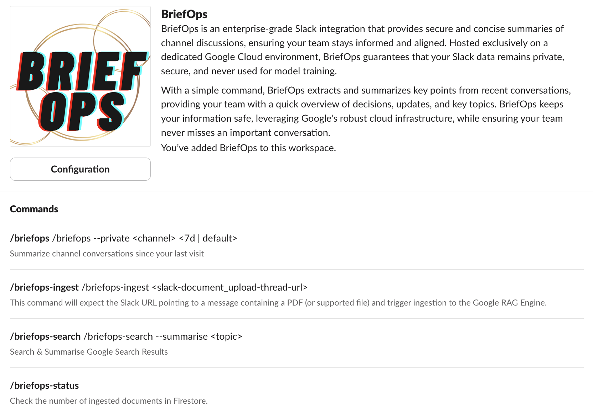
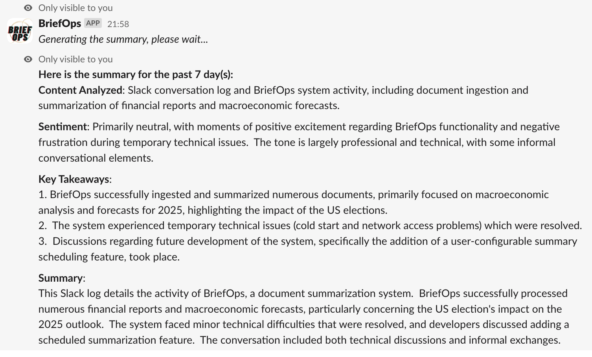
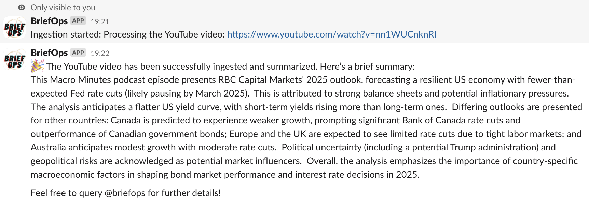
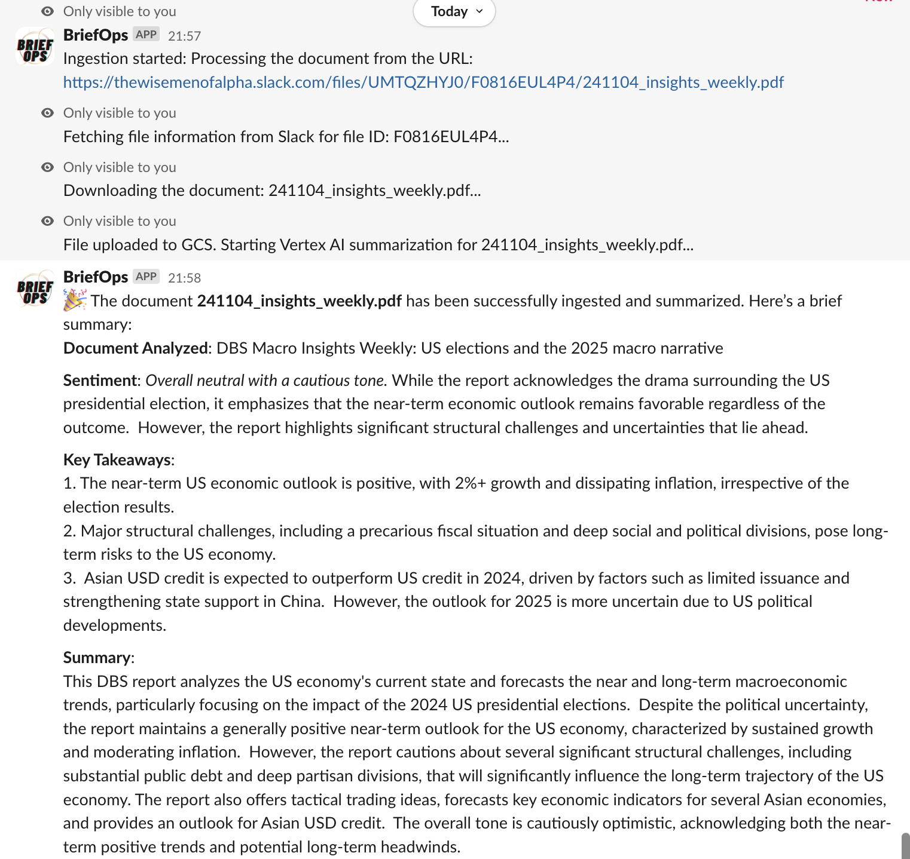
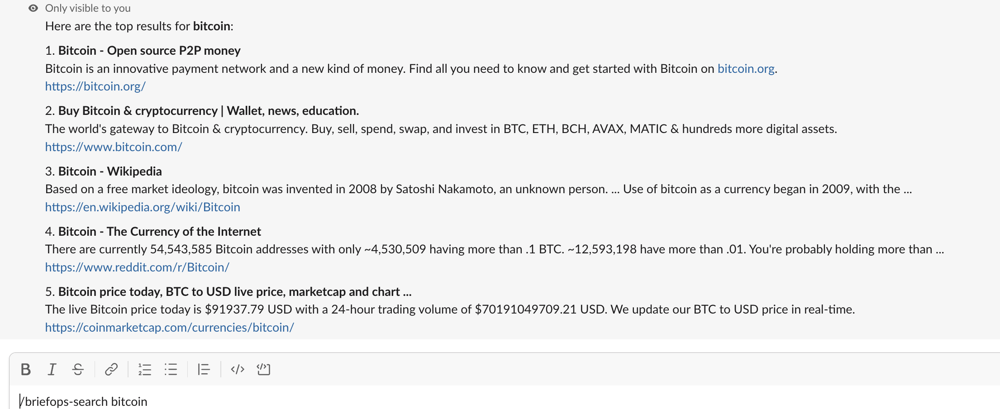
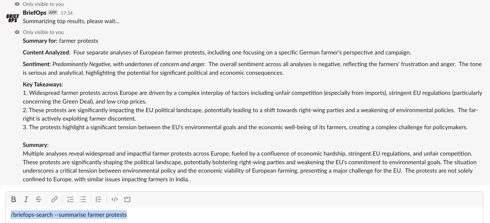

# BriefOps

**BriefOps** is a Slack app that helps teams stay on top of important conversations by summarizing Slack channels, documents, and YouTube videos. Built on **Google Cloud**, it leverages **Vertex AI** for summarization and integrates **Dialogflow CX** for enhanced conversational interactions, offering a fully secure, private deployment in your own Google Cloud environment.

## Current Release: Beta3`
 
### Added the Following Features:

 - `Channel Summarization`, 
 - `Document (formatting upgrade)` and 
 - `Youtube Video Ingestion and summarisation` 
 - `initial Dialogflow CX Integration`
 - `Google Search` and `Google Search Summarisation of Source Results`




## Published Blog

The actualy hands-on Experience writing up this App/Integration is published on the [Google Cloud Medium Publication here.](https://medium.com/google-cloud/slack-googlecloud-briefops-streamlining-slack-comms-with-gcp-ai-powered-summarisation-ec2151672731)


## Features

- **Channel Summarization**: Use `/briefops [days]` to summarize conversations over a set period, helping users catch up on important updates. _(Default: last 7 days)_
- **Document and Video Ingestion**: Use `/briefops-ingest [file URL or YouTube link]` to ingest and summarize documents and YouTube videos, providing concise summaries and key takeaways.
- **Dialogflow CX Integration**: An integrated Dialogflow CX agent acts as an assistant for future conversations, enhancing user interactions within Slack.
- **Grounding Content**: Uploaded files and YouTube content can be flagged with `--grounding` and are stored securely in your Google Cloud Storage bucket for future reference.
- **Secure and Private**: Fully deployed within your own Google Cloud project, ensuring enterprise-level privacy and security.
- **Customizable Deployments**: Choose the Google Cloud region and adjust configurations to meet your operational needs.
- **Search and Summarise Web**: Capability to google search and flag `--summarise` to sumamrise top search results in a single report.

## Getting Started

### Prerequisites

Before starting, ensure you have the following:

- A **Google Cloud project** with billing enabled.
- A **Slack workspace** where you have permission to install apps.
- **Terraform** installed to provision Google Cloud resources.
- **gcloud CLI** installed and authenticated.

## Architecture Overview


mages/summarise-example.png

This architecture showcases how Slack commands directly interact with Google Cloud components. The Slack user remains at the core of the summarization process, ensuring privacy and clarity by indicating where processing occurs and how responses are delivered back to the user.

### Step 1: Enable Required Google Cloud APIs

Set your Google Cloud project ID:

```bash
export GOOGLE_CLOUD_PROJECT="your-project-id"

Run the following command to enable all necessary Google Cloud services:

gcloud services enable \
  aiplatform.googleapis.com \
  artifactregistry.googleapis.com \
  cloudbuild.googleapis.com \
  cloudfunctions.googleapis.com \
  cloudresourcemanager.googleapis.com \
  compute.googleapis.com \
  containerregistry.googleapis.com \
  dialogflow.googleapis.com \
  firestore.googleapis.com \
  iam.googleapis.com \
  iamcredentials.googleapis.com \
  logging.googleapis.com \
  monitoring.googleapis.com \
  run.googleapis.com \
  secretmanager.googleapis.com \
  storage.googleapis.com \
  --project=$GOOGLE_CLOUD_PROJECT
  ```

### Step 2: Clone the Repository

Clone the BriefOps repository:
```
git clone https://github.com/YOUR_USERNAME/briefops-public.git
cd briefops-public
```

### Step 3: Configure Environment Variables

Ensure that you have the necessary environment variables for your Google Cloud project and Slack tokens. These values will be set in Google Secret Manager via Terraform.

Create a terraform.tfvars file and provide the following values:

```
# terraform.tfvars

# Terraform variables
project_id           = "your-google-cloud-project-id" # Change this to $GOOGLE_CLOUD_PROJECT
region               = "us-central1"  # Change to your preferred region
service_account_name = "briefops-service-account"
app_name             = "briefops"
container_image      = "gcr.io/your-google-cloud-project-id/briefops:latest"
memory               = "2Gi"
max_instances        = 5

# Slack tokens (these will be stored in Secret Manager)
SLACK_APP_TOKEN      = "your-slack-app-token"
SLACK_BOT_TOKEN      = "your-slack-bot-token"
SLACK_SIGNING_SECRET = "your-slack-signing-secret"
```

### Step 4: Deploy with Terraform

To deploy BriefOps on Google Cloud using Terraform, navigate to the root of the project directory and run:

```
terraform init
terraform apply
```


This will provision the following Google Cloud resources:
- Cloud Run to run the app.
- Vertex AI for model inference and summarization tasks.
- Dialogflow CX agent for conversational interactions.
- Secret Manager to securely store Slack tokens.
- Firestore for data storage.
- Cloud Storage bucket for storing ingested content.

### Step 5: Install the App in Slack

  1.	Create a New Slack App: Go to the Slack API website and create a new app for your workspace. 
  2.	Set Up OAuth Tokens: Configure the OAuth scopes as specified below.
  3.	Install the App: Install the app to your workspace.
  4.	Update Secrets: Copy the Slack Bot Token, App Token, and Signing Secret to your Terraform variables (terraform.tfvars) or directly into Secret Manager.

  Required OAuth Scopes

To enable all functionalities, the following Slack OAuth scopes are required:
- `app_mentions:rea`d - To read messages that mention the bot.
- `commands` - To register and listen for slash commands.
- `channels:read` - To read channel metadata.
- `channels:history` - To read messages from public channels.
- `chat:write` - To send messages and summaries back to channels.
- `conversations:read` - To access metadata about conversations.
- `conversations:history` - To read messages in private channels or threads.
- `files:read` - To download files shared in Slack.
- `groups:read` - To read private channel (group) metadata.
- `im:history` - To read direct messages.
- `im:write` - To send direct messages to users.


## Usage

### Summarize Channel Conversations

Use the `/briefops` command to summarize conversations in the current channel over a specified number of days:

```
/briefops [days]
```
Example: `/briefops 7`



This will summarize the last 7 days of messages in the current channel.

### Ingest and Summarize Documents and Videos

Use the `/briefops-ingest` command to ingest and summarize documents or YouTube videos:

```
/briefops-ingest [file URL or YouTube link]
```
Examples: 

- YouTube Video: `/briefops-ingest https://www.youtube.com/watch?v=VIDEO_ID`





- Slack File URL:  `/briefops-ingest https://files.slack.com/files-pri/TXXXXXXX-FXXXXXXX/your_document.pdf`





*Upcoming capability* 
The content will be uploaded to Google Cloud Storage with a `--grounding` flag for Dialogflow CX AI Agent grounding, for future conversaation reference. 
This work is in progress `(19th Nov 2024)`

### Interact with the Dialogflow CX Agent

Mention the bot in a channel or send a direct message to interact with the integrated Dialogflow CX agent:
`@BriefOps Hello!`

The agent will respond based on the intents and flows configured in Dialogflow CX. This is WIP.

### Perform Web Searches

Use the `/briefops-search` command to perform web searches directly from Slack:

```
/briefops-search [search query]
```
Example: `/briefops-search latest trends in AI`

This will return the top web search results for the provided query.
Note: Ensure that the Google Custom Search API is enabled and configured as per the setup instructions.



### Perform Summarized Web Searches

Use the `/briefops-search` command with the `--summarise` flag to perform web searches and produce a single summarised mini report across top 5 search results. The use of `--public` will make such search summarisation viable to everyone in the channel.

```
/briefops-search [search query] --summarise --public
```

Example:

`/briefops-search latest trends in AI --summarise`

This will fetch and summarize the content of the top 5 web search results for the provided query.




Notes:
- Response Time: Summarizing content may take longer than a standard search.
- Compliance: Ensure that fetching and summarizing content complies with the websites’ terms of service.
- Content Limitations: Some pages may not allow content to be fetched or may have protections against scraping.
  
## Variables & Tunables

### Model Tuning (Vertex AI)

- Model Version: `gemini-1.5-flash-002` for summarization.
- Location: `us-central1` for Google Cloud region.
- Temperature: `0.3` for deterministic outputs.
- Max Output Tokens: `1024` for concise summaries.
- Top-P: `0.9` for cumulative probability in word selection.
- Top-K: `40` for balanced variation in next-word prediction.

### Slack Configuration

- Tokens: Set SLACK_BOT_TOKEN, SLACK_SIGNING_SECRET, and SLACK_APP_TOKEN for secure bot communication.

### Free Tier Configuration

- Daily Limit: FREE_TIER_DAILY_LIMIT=0 (no daily restrictions).
- Max Days: FREE_TIER_MAX_DAYS=0 (no day range limit).

These settings optimize performance, user experience, and access limits for both free and premium users.

## Continuous Integration and Deployment (CI/CD) with Google Cloud Build

When developing and deploying applications in Google Cloud, it’s essential to follow a secure Software Development Lifecycle (SDLC). For BriefOps, using Google Cloud Build allows for the automated building, scanning, and deploying of Docker images in a secure and controlled environment.

### Example cloudbuild.yaml Configuration
```
steps:
  # Step 1: Build the Docker image
  - name: 'gcr.io/cloud-builders/docker'
    args: ['build', '-t', 'gcr.io/$PROJECT_ID/briefops:$COMMIT_SHA', '.']
    id: 'Build Image'

  # Step 2: Push the Docker image to Google Container Registry
  - name: 'gcr.io/cloud-builders/docker'
    args: ['push', 'gcr.io/$PROJECT_ID/briefops:$COMMIT_SHA']
    id: 'Push Image'

  # Step 3: Deploy to Cloud Run
  - name: 'gcr.io/google.com/cloudsdktool/cloud-sdk'
    entrypoint: gcloud
    args:
      - 'run'
      - 'deploy'
      - '${_SERVICE}'
      - '--image'
      - 'gcr.io/$PROJECT_ID/briefops:$COMMIT_SHA'
      - '--region'
      - '${_REGION}'
      - '--platform'
      - 'managed'
      - '--allow-unauthenticated'
      - '--set-secrets'
      - 'SLACK_APP_TOKEN=SLACK_APP_TOKEN:latest'
      - '--set-secrets'
      - 'SLACK_BOT_TOKEN=SLACK_BOT_TOKEN:latest'
      - '--set-secrets'
      - 'SLACK_SIGNING_SECRET=SLACK_SIGNING_SECRET:latest'
      - '--service-account'
      - 'briefops-service-account@your-project-id.iam.gserviceaccount.com'
    id: 'Deploy to Cloud Run'

options:
  logging: CLOUD_LOGGING_ONLY

substitutions:
  _REGION: us-central1
  _SERVICE: briefops
  
```

### Benefits of the CI/CD Setup

- Automated Build & Deploy: Ensures consistency in every release by automating the build and deployment steps.
- Container Scanning: Integrating container scanning tools with Cloud Build helps detect vulnerabilities early in the SDLC process.
- Secret Management: Sensitive information such as Slack Tokens is managed securely with Google Secret Manager, ensuring they are not exposed during builds or in source code.
- IAM Policies: Cloud Build steps are executed using IAM service accounts with least privilege access, ensuring that only necessary permissions are granted.
- Logging and Monitoring: Using Cloud Logging and Monitoring ensures that all actions within the build pipeline and the deployed application are tracked and auditable.

Benefits of the CI/CD Setup

- Automated Build & Deploy: Ensures consistency in every release by automating the build and deployment steps.
- Container Scanning: Integrating container scanning tools with Cloud Build helps detect vulnerabilities early in the SDLC process.
- Secret Management: Sensitive information such as Slack Tokens is managed securely with Google Secret Manager, ensuring they are not exposed during builds or in source code.
- IAM Policies: Cloud Build steps are executed using IAM service accounts with least privilege access, ensuring that only necessary permissions are granted.
- Logging and Monitoring: Using Cloud Logging and Monitoring ensures that all actions within the build pipeline and the deployed application are tracked and auditable.

## Security and Privacy Considerations

BriefOps is designed with privacy and security in mind:
- Deployment Control: Deployed entirely within your own Google Cloud environment for full control.
- Data Privacy: No data is shared with third-party services, and content is not used for model training.
- Best Practices: Adheres to Google Cloud’s best practices for least privilege and secure access using IAM roles and Secret Manager.

## Required IAM Roles

The service account will be configured with the following roles:
- `roles/aiplatform.user`: Vertex AI access for summarization models.
- `roles/dialogflow.admin`: Access to Dialogflow CX resources.
- `roles/storage.admin`: Access to Cloud Storage for file uploads.
- `roles/datastore.user`: Access to Firestore for data storage.
- `roles/secretmanager.secretAccessor`: Access to secrets like Slack tokens stored in Secret Manager.
- `roles/logging.logWriter`: Write logs to Cloud Logging for monitoring.
- `roles/monitoring.viewer`: View monitoring metrics for the deployed service.


## License
This project is licensed under the MIT License. See the LICENSE file for details.