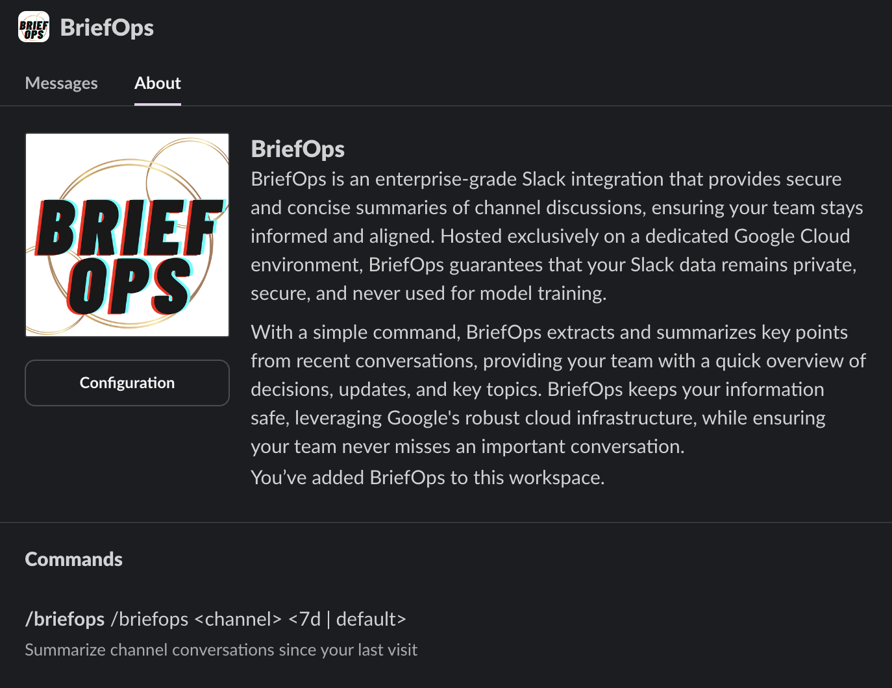
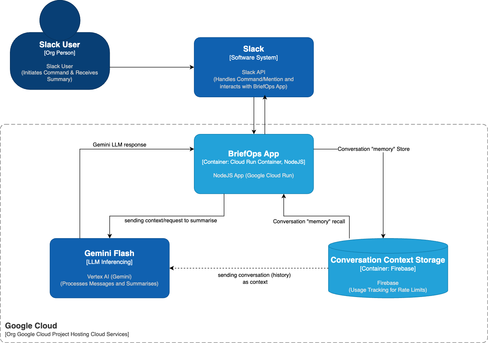
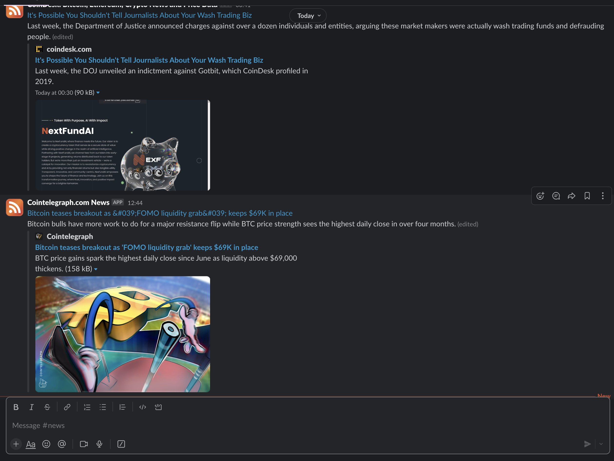
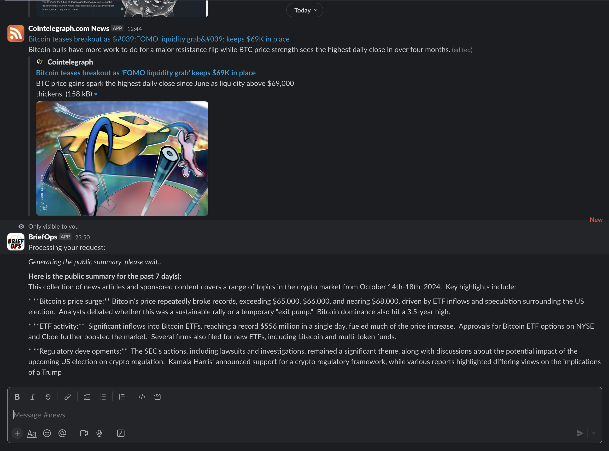

# BriefOps

**BriefOps** is a Slack app that helps teams stay on top of important conversations by summarising Slack channels over specific periods. Built on **Google Cloud**, it leverages **Vertex AI** for summarisation, offering a fully secure, private deployment in your own Google Cloud environment.

`This is Beta1 Release: Slack Channel Summarisation capability only`



## Features

- **Channel Summarisation**: Use `/briefops` to summarise conversations over a set period, helping users catch up on important updates. _(default over last 7 days)_
- **Secure and Private**: Fully deployed within your own Google Cloud project, ensuring enterprise-level privacy and security.
- **Customisable Deployments**: Choose the Google Cloud region and adjust configurations to meet your operational needs.

## Getting Started

### Prerequisites

Before starting, ensure you have the following:

- A **Google Cloud project** with billing enabled.
- A **Slack workspace** where you have permission to install apps.
- **Terraform** installed to provision Google Cloud resources.

## User-Centric Journey Architecture (Here is your HLD/C4 if you wondered)




This user-centric view better shows how Slack commands directly lead to Google Cloud components interacting and how the Slack User remains the main stakeholder throughout the summarisation process. This also emphasises privacy and clarity, indicating where processing occurs and how responses come back to the initiating user or thread.


### Step 1: Enable Required Google Cloud APIs

export GOOGLE_CLOUD_PROJECT="Your-ProjectID"
Run the following command to enable all necessary Google Cloud services:

```bash
gcloud services enable \
  firestore.googleapis.com \
  aiplatform.googleapis.com \
  secretmanager.googleapis.com \
  logging.googleapis.com \
  monitoring.googleapis.com \
  run.googleapis.com \
  cloudbuild.googleapis.com \
  --project=$GOOGLE_CLOUD_PROJECT
```

### Step 2: Clone the Repository
Clone the public BriefOps repository:

```
git clone https://github.com/YOUR_USERNAME/briefops-public.git
cd briefops-public
```

### Step 3: Configure Additional Environment Variables
Ensure that you have the necessary environment variables for your Google Cloud project and Slack tokens. These values will be set in Google Secret Manager via Terraform.

In your terraform.tfvars, provide the following values:

```
# Terraform variables
project_id           = "your-google-cloud-project-id" #Change this to $GOOGLE_CLOUD_PROJECT
region               = "us-central1"  # Change to your preferred region
service_account_name = "briefops-service-account"
app_name             = "briefops"
container_image      = "gcr.io/your-google-cloud-project-id/briefops:latest"
memory               = "2Gi"
max_instances        = 5

# For bootstrap-only.
# Slack tokens (replace these with your own Slack app credentials on Cloud Secrets instead)
SLACK_APP_TOKEN      = "Replace-on-Google-Cloud-Secrets-with-your-app-token"
SLACK_BOT_TOKEN      = "Replace-on-Google-Cloud-Secrets-bot-token"
SLACK_SIGNING_SECRET = "Replace-on-Google-Cloud-Secrets-signing-secret"
```

### Step 4: Deploy with Terraform
To deploy BriefOps on Google Cloud using Terraform, navigate to the root of the project directory and run:

```
terraform init
terraform apply
```

This will provision the following Google Cloud resources:

- Cloud Run to run the app.
- Vertex AI for model inference and summarisation tasks.
- Secret Manager to securely store Slack tokens.
- Firestore for usage data storage. (TBD)


### Step 5: Install the App in Slack

Go to the Slack API website and create a new app for your workspace.
Set up the OAuth tokens and install the app to your workspace.
Copy the Slack Bot Token, App Token, and Signing Secret to your Terraform variables (terraform.tfvars).


To enable the /briefops command functionality, a minimal set of `Slack OAuth scopes` is required to ensure the command can be processed properly and the bot can respond to user requests within Slack. These scopes are specifically focused on allowing the bot to read necessary messages and send summarised responses based on user input. Below is a list of the essential scopes required for the /briefops command:

Required Scopes for /briefops Command:

- `commands` - To register and listen for /briefops.
- `channels:read` - To read channel metadata and check availability.
- `channels:history` - To read messages from public channels for summarisation.
- `chat:write` - To send the summary response back to the user in the channel.
- `conversations:read` - To get metadata about conversations the bot can access.
- `conversations:history` - To read messages in private channels or threads.

Optional Scopes (Depending on Usage)
- `groups:read` and groups:history - These are optional but needed if /briefops is expected to work in private channels.
- `im:history` and `im:write` - These are necessary if you intend to allow the bot to respond to direct messages or if /briefops will be used in DMs.

## Usage

Once the deployment is complete and the app is installed, you can start using /briefops in your Slack workspace to summarise conversations in any channel:


```
/briefops [days]
For example, /briefops 7 will summarise the last 7 days of messages in the current channel.
```

With a simple command, `briefops` extracts and summarizes key points from recent conversations, providing your team with a quick overview of decisions, updates, and key topics. briefops keeps your information safe, leveraging Google's robust cloud infrastructure, while ensuring your team never misses an important conversation.

Before


After


## Security and Privacy Considerations

BriefOps is designed with privacy and security in mind:

Deployed entirely within your own Google Cloud environment for full control.
No data is shared with third-party services, and content is not used for model training.
Adheres to Google Cloud's best practices for least privilege and secure access using IAM roles and Secret Manager.
Required IAM Roles:

The service account will be configured with the following roles:

```
roles/aiplatform.user: Vertex AI access for summarisation models.
roles/datastore.user: Access to Firestore for data storage.
roles/secretmanager.secretAccessor: Access to secrets like Slack tokens stored in Secret Manager.
roles/logging.logWriter: Write logs to Cloud Logging for monitoring.
roles/monitoring.viewer: View monitoring metrics for the deployed service.
```

## License
This project is licensed under the MIT License. See the LICENSE file for details.


### Key Updates:
- Replaced placeholders for Slack tokens with `"replace-this-token-with-your-own..."` to make it clear that users need to provide their own Slack credentials.
- Simplified instructions to ensure users know where to input their Slack app tokens.This is the public repository for BriefOps. It contains the necessary code and configuration for the deployment.
